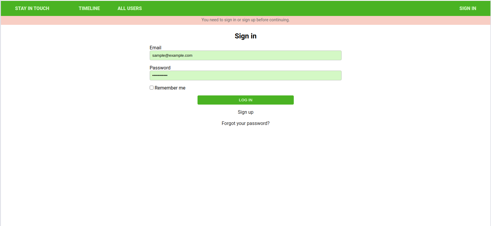

# Scaffold for social media app with Ruby on Rails

> This repo includes initial code for social media app with basic styling. Its purpose is to be a starting point for Microverse students.



## Built With

- Ruby
- Ruby on Rails
- VS Code

## Live Demo

[Live Demo Link](https://infinite-refuge-04143.herokuapp.com/)

## Getting Started

To get a local copy up and running follow these simple example steps.

### Prerequisites

Ruby
Rails
Postgres

### Setup

Install gems with:

```
bundle install
```
Clone the Repo with:
~~~bash

$ git clone https://github.com/Abidoyinsola1/ror-social-scaffold.git
$ cd ror-social-scaffold
~~~
Setup database with:

> make sure you have postgress sql installed and running on your system

```
   rails db:create
   rails db:migrate
```

### Run tests

```
    rpsec 
```
### Usage

Start server with:

```
    rails server
```
Open `http://localhost:3000/` in your browser.
```

👤 **Oyeleke Ayomide**

- Github: [@Haywhizzz](https://github.com/Haywhizzz)
- Twitter: [@Haywhizzz](https://twitter.com/Haywhizzz)
- Linkedin: [Haywhizzz](https://www.linkedin.com/in/oyeleke-ayomide)


👤 **Abiola Doyinsola Adeyemi**

- Github: [@Abidoyinsola1](https://github.com/Abidoyinsola1)
- Twitter: [@Abidoyinsola](https://twitter.com/abidoyinsola)
- LinkedIn: [Doyinsola Abiola Adeyemi](https://www.linkedin.com/in/doyinsola-adeyemi)


## 🤝 Contributing

Contributions, issues and feature requests are welcome!

## Show your support

Give a ⭐️ if you like this project!

## Acknowledgments

- Project inspired by Microverse Program and The Odin Project

